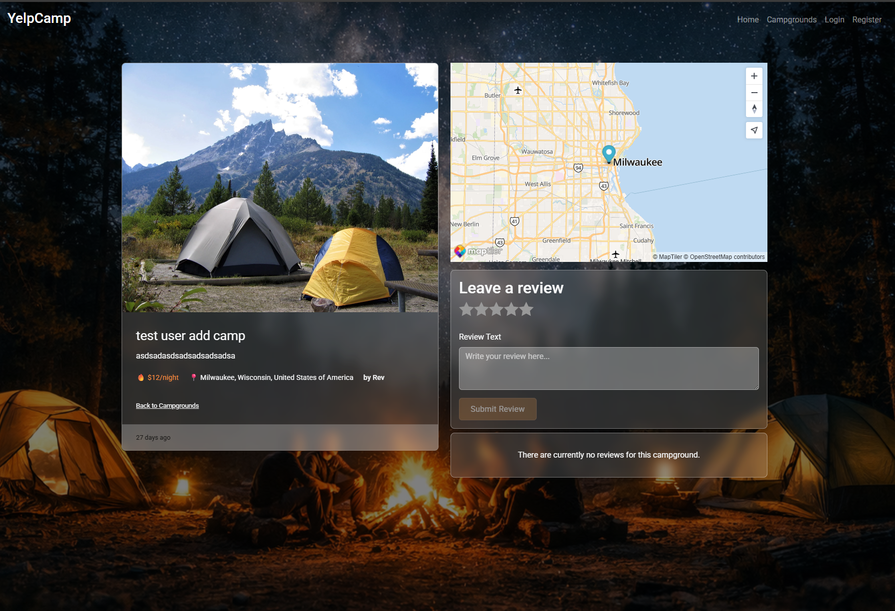

<a id="readme-top"></a>

<div align="center">
  <a href="https://github.com/your_username/YelpCamp">
  </a>

  <h3 align="center">YelpCamp</h3>

  <p align="center">
    A full-stack campground review application built with Angular, Node.js, MongoDB, and MapTiler.
    <br />
    <br />
    <a href="https://yelpcamp-5u6m.onrender.com">🚀 Live Demo</a>
  </p>
</div>

> ⚠️ **Note:** This application is deployed on **Render (free tier)**.  
 Initial requests may take a few seconds due to server cold starts.

---

## Table of Contents

<details>
  <summary>Table of Contents</summary>
  <ol>
    <li><a href="#about-the-project">About The Project</a></li>
    <li><a href="#tech-stack">Tech Stack</a></li>
    <li><a href="#getting-started">Getting Started</a></li>
    <li><a href="#project-structure">Project Structure</a></li>
      <ul>
        <li><a href="#prerequisites">Prerequisites</a></li>
        <li><a href="#installation">Installation</a></li>
      </ul>
    <li><a href="#demo-account">Demo Account</a></li>
    <li><a href="#seeding-the-database">Seeding the Database</a></li>
    <li><a href="#responsive">Responsive Design</a></li>
    <li><a href="#screenhots">Screenshots</a></li>
    <li><a href="#learning-goals">Learning Goals</a></li>
    <li><a href="#roadmap">Roadmap</a></li>
    <li><a href="#license">License</a></li>
    <li><a href="#acknowledgments">Acknowledgments</a></li>
    <li><a href="#author">Author</a></li>
  </ol>
</details>

---

## <a id="about-the-project"> About The Project </a>

**YelpCamp** is a full-stack web application that allows users to discover, review, and share campgrounds. Users can explore campgrounds, view locations on an interactive map, leave reviews, upload images, and manage their own campground listings through secure, session-based authentication.

This project is built as a learning-focused and showcase-driven full-stack application, designed to deepen and demonstrate my knowledge of Angular 19, RxJS, and NgRx on the frontend, alongside a Node.js + Express backend and MongoDB for data persistence. It emphasizes reactive data flows, state management, validation, authentication, and real-world application architecture.

**✨ Key features:**

- 🌍 Browse and search campgrounds

- 🗺️ Interactive map with campground locations (Mapbox)

- 👤 User authentication (register / login / logout)

- 🔐 Frontend & backend authentication and authorization

- ✅ Data validation on both frontend (Angular forms) and backend (Mongoose / Joi)

- 🗂️ Session-based authentication with persistent session data

- 🏕️ Create, edit, and delete campgrounds (authenticated users)

- 💬 Add and delete reviews

- 🖼️ Upload campground images (Cloudinary integration)

- 🔐 Route protection (backend middleware)

- 🧪 Demo account for visitors

- 📱 Responsive design (desktop, laptop & mobile)

<p align="right">(<a href="#readme-top">back to top</a>)</p>

---

## <a id="tech-stack"> 🛠️ Tech Stack </a>

**Frontend**


<br>

**Backend**


<br>

**Other Tools**


<p align="right">(<a href="#readme-top">back to top</a>)</p>

---

## <a id="project-structure"> 📂 Project Structure </a>

**Frontend**
```bash
client/
└── src/
    ├── app/
    │   ├── features/            # Feature-based components
    │   │   ├── campgrounds/
    │   │   ├── campground-details/
    │   │   ├── home/
    │   │   ├── auth/
    │   │   └── not-found/
    │   │
    │   ├── shared/              # Truly reusable
    │   │   ├── components/
    │   │   │   ├── header/
    │   │   │   ├── footer/
    │   │   │   ├── loading/
    │   │   │   ├── dialog/
    │   │   │   └── campground-map/
    │   │   ├── material/
    │   │   └── forms/
    │   │
    │   ├── core/                # App-wide singletons
    │   │   ├── interceptors/
    │   │   └── services/
    │   │   
    │   │
    │   ├── models/
    │   ├── store/               # NgRx (actions, reducers, effects)
    │   │
    │   ├── app.component.*
    │   ├── app.routes.ts
    │   └── app.config.ts
    │
    ├── environments/
    ├── styles/
    │   ├── tokens/
    │   └── styles.scss
    │
    ├── main.ts
    └── index.html


```

**Backend**

```sh
server/
├── config/
│   └── cloudinary.js
├── controllers/
├── models/
├── routes/
├── utils/
├── seeds/
├── uploads/
├── middleware.js
├── app.js
└── package.json

```
<p align="right">(<a href="#readme-top">back to top</a>)</p>
<br>

## <a id="getting-started">🚀 Getting Started</a>

**<a id="prerequisites">Prerequisites</a>**

- Node.js (v18+ recommended)

- MongoDB (local or Atlas)

- Angular CLI

- Node.js
  ```sh
  npm install npm@latest -g
  ```
  <br>

## ⚙️<a id="installation">Installation</a>

**1️⃣ Clone the repository**

```sh
git clone https://github.com/Zeras12314/yelpcamp.git
cd yelpCamp
```

<br>

**2️⃣ Backend setup**

```sh
cd server
npm install
```

Create a .env file inside the server folder:

```sh
CLOUDINARY_NAME=your_cloudinary_name
CLOUDINARY_KEY=your_cloudinary_key
CLOUDINARY_SECRET=your_cloudinary_secret
MAPTILER_API_KEY=your_maptiler_key
MONGODB_USERNAME=your_mongo_username
MONGODB_PASSWORD=your_mongo_password
SESSION_SECRET=your_session_secret
```

Start the backend server:

```sh
npm start
```

<br>

**3️⃣ Frontend setup**

```sh
cd ../client
npm install
ng serve
```

Frontend will run at:

```sh
http://localhost:4200
```

<br>
<p align="right">(<a href="#readme-top">back to top</a>)</p>

## <a id="demo-account">🔑 Demo Account</a>

For quick access, you can use the demo account:

```sh
Username: user
Password: test
```

## <a id="seeding-the-database">🔑 Seeding the Database</a>

To populate the database with sample campgrounds:

```sh
cd server
node seeds/index.js
```

<br>

## <a id="responsive">📱 Responsive Design</a>

- Optimized for desktop, laptop, tablet, and mobile screens

- Height‑aware layouts to prevent content overlap on smaller laptop screens

- Mobile‑first adjustments using width and height media queries

## <a id="screenshots">📸 Screenshots</a>




## <a id="learning-goals">🧠 Learning Goals</a>

- This project was built to practice:

- Full‑stack architecture

- RESTful API design

- Authentication & authorization

- Angular state management & observables

- Responsive UI design

- Working with maps and geospatial data

<br>

<p align="right">(<a href="#readme-top">back to top</a>)</p>

## <a id="roadmap">🗺️ Roadmap / Improvements</a>

🔍 Advanced search & filtering

⭐ Campground ratings

🧭 User profiles

🧪 Unit & e2e tests

🌐 Internationalization (i18n)

<br>

## <a id="license">📄 License</a>

This project is for educational purposes.

## <a id="acknowledgments">🙌 Acknowledgements</a>

- Inspired by Colt Steele’s YelpCamp project

- Map data powered by Mapbox

- UI inspirations from modern outdoor & travel apps

<br>

## <a id="author">👤 Author</a>

<strong>Gerson Tiongson</strong>

<p>Angular Developer | Full-Stack Learner</p>

📧 **Email:** tiongsongerson@gmail.com 
<br>
💼 **LinkedIn:** https://www.linkedin.com/in/gerson-tiongson/  

<p align="right">(<a href="#readme-top">back to top</a>)</p>